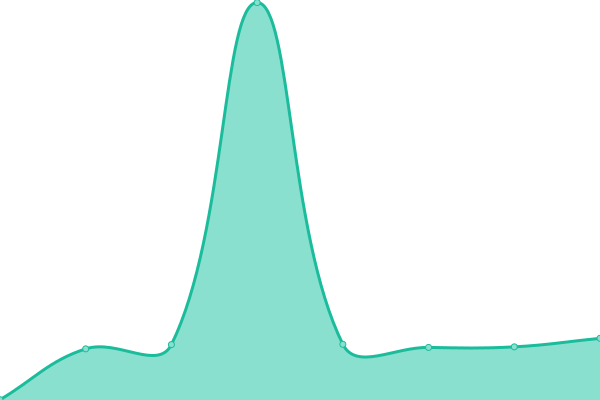

# [📈 Live Status](https://fjvigil89.github.io/upptime): <!--live status--> **🟧 Partial outage**

This repository contains the open-source uptime monitor and status page for [fjvigil89](https://fjvigil89.github.io/upptime), powered by [Upptime](https://github.com/upptime/upptime).

With [Upptime](https://upptime.js.org), you can get your own unlimited and free uptime monitor and status page, powered entirely by a GitHub repository. We use [Issues](https://github.com/fjvigil89/upptime/issues) as incident reports, [Actions](https://github.com/fjvigil89/upptime/actions) as uptime monitors, and [Pages](https://fjvigil89.github.io/upptime) for the status page.

<!--start: status pages-->
<!-- This summary is generated by Upptime (https://github.com/upptime/upptime) -->
<!-- Do not edit this manually, your changes will be overwritten -->
<!-- prettier-ignore -->
| URL | Status | History | Response Time | Uptime |
| --- | ------ | ------- | ------------- | ------ |
|  [Ages Web](https://fjvigil89.github.io/ages_web/) | 🟩 Up | [ages-web.yml](https://github.com/fjvigil89/upptime/commits/HEAD/history/ages-web.yml) | 

 76ms
     
 | 

<a href="https://fjvigil89.github.io/upptime/history/ages-web">100.00%</a>
    

|  [World Profe](https://plataformawp.es/) | 🟥 Down | [world-profe.yml](https://github.com/fjvigil89/upptime/commits/HEAD/history/world-profe.yml) | 

 0ms
     
 | 

<a href="https://fjvigil89.github.io/upptime/history/world-profe">0.00%</a>
    

|  [Web TuVoz](http://155.210.153.12/auth/login) | 🟩 Up | [web-tu-voz.yml](https://github.com/fjvigil89/upptime/commits/HEAD/history/web-tu-voz.yml) | 

 197ms
     
 | 

<a href="https://fjvigil89.github.io/upptime/history/web-tu-voz">100.00%</a>
    

|  [Api TuVoz](http://155.210.153.12:8080/) | 🟩 Up | [api-tu-voz.yml](https://github.com/fjvigil89/upptime/commits/HEAD/history/api-tu-voz.yml) | 

 279ms
     
 | 

<a href="https://fjvigil89.github.io/upptime/history/api-tu-voz">100.00%</a>
    

|  [BootCrypto](http://155.210.153.12:81/) | 🟩 Up | [boot-crypto.yml](https://github.com/fjvigil89/upptime/commits/HEAD/history/boot-crypto.yml) | 

 318ms
     
 | 

<a href="https://fjvigil89.github.io/upptime/history/boot-crypto">100.00%</a>
    

|  [Redmine](http://155.210.153.12:8200/) | 🟩 Up | [redmine.yml](https://github.com/fjvigil89/upptime/commits/HEAD/history/redmine.yml) | 

 1254ms
     
 | 

<a href="https://fjvigil89.github.io/upptime/history/redmine">9.14%</a>
    

|  [Odoo](http://155.210.153.12:10012/) | 🟩 Up | [odoo.yml](https://github.com/fjvigil89/upptime/commits/HEAD/history/odoo.yml) | 

 266ms
     
 | 

<a href="https://fjvigil89.github.io/upptime/history/odoo">100.00%</a>
    

<!--end: status pages-->

[**Visit our status website →**](https://fjvigil89.github.io/upptime)

## 📄 License

- Powered by: [Upptime](https://github.com/upptime/upptime)
- Code: [MIT](./LICENSE) © [fjvigil89](https://fjvigil89.github.io/upptime)
- Data in the `./history` directory: [Open Database License](https://opendatacommons.org/licenses/odbl/1-0/)
