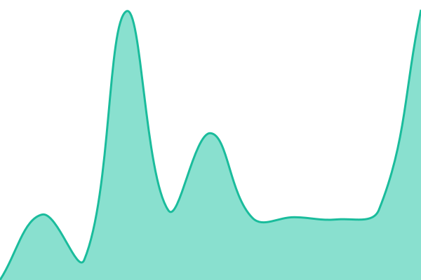
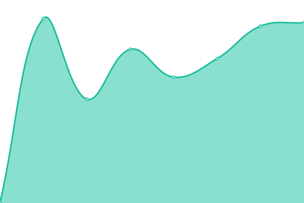

# [📈 Live Status](https://fjvigil89.github.io/upptime): <!--live status--> **🟧 Partial outage**

This repository contains the open-source uptime monitor and status page for [fjvigil89](https://fjvigil89.github.io/upptime), powered by [Upptime](https://github.com/upptime/upptime).

With [Upptime](https://upptime.js.org), you can get your own unlimited and free uptime monitor and status page, powered entirely by a GitHub repository. We use [Issues](https://github.com/fjvigil89/upptime/issues) as incident reports, [Actions](https://github.com/fjvigil89/upptime/actions) as uptime monitors, and [Pages](https://fjvigil89.github.io/upptime) for the status page.

<!--start: status pages-->
<!-- This summary is generated by Upptime (https://github.com/upptime/upptime) -->
<!-- Do not edit this manually, your changes will be overwritten -->
<!-- prettier-ignore -->
| URL | Status | History | Response Time | Uptime |
| --- | ------ | ------- | ------------- | ------ |
|  [Ages Web](https://fjvigil89.github.io/ages_web/) | 🟩 Up | [ages-web.yml](https://github.com/fjvigil89/upptime/commits/HEAD/history/ages-web.yml) | 

 109ms
     
 | 

<a href="https://fjvigil89.github.io/upptime/history/ages-web">100.00%</a>
    

|  [Alamops](https://www.alamops.com/) | 🟩 Up | [alamops.yml](https://github.com/fjvigil89/upptime/commits/HEAD/history/alamops.yml) | 

 7072ms
     
 | 

<a href="https://fjvigil89.github.io/upptime/history/alamops">100.00%</a>
    

|  [AWS-Alamops](http://3.64.114.185:80/) | 🟩 Up | [aws-alamops.yml](https://github.com/fjvigil89/upptime/commits/HEAD/history/aws-alamops.yml) | 

 226ms
     
 | 

<a href="https://fjvigil89.github.io/upptime/history/aws-alamops">100.00%</a>
    

|  [Iac-Alamops](https://iac.alamops.com/) | 🟩 Up | [iac-alamops.yml](https://github.com/fjvigil89/upptime/commits/HEAD/history/iac-alamops.yml) | 

 454ms
     
 | 

<a href="https://fjvigil89.github.io/upptime/history/iac-alamops">100.00%</a>
    

|  [Api-Alamops](https://api.alamops.com/health) | 🟩 Up | [api-alamops.yml](https://github.com/fjvigil89/upptime/commits/HEAD/history/api-alamops.yml) | 

 615ms
     
 | 

<a href="https://fjvigil89.github.io/upptime/history/api-alamops">100.00%</a>
    

|  [Jenkins-Alamops](https://jenkins.alamops.com/login?from=%2F) | 🟥 Down | [jenkins-alamops.yml](https://github.com/fjvigil89/upptime/commits/HEAD/history/jenkins-alamops.yml) | 

 0ms
     
 | 

<a href="https://fjvigil89.github.io/upptime/history/jenkins-alamops">0.00%</a>
    

|  [Grafana-Alamops](https://grafana.alamops.com/login) | 🟩 Up | [grafana-alamops.yml](https://github.com/fjvigil89/upptime/commits/HEAD/history/grafana-alamops.yml) | 

 561ms
     
 | 

<a href="https://fjvigil89.github.io/upptime/history/grafana-alamops">100.00%</a>
    

|  [Iris-Alamops](https://iris.alamops.com) | 🟩 Up | [iris-alamops.yml](https://github.com/fjvigil89/upptime/commits/HEAD/history/iris-alamops.yml) | 

 433ms
     
 | 

<a href="https://fjvigil89.github.io/upptime/history/iris-alamops">100.00%</a>
    

<!--end: status pages-->

[**Visit our status website →**](https://fjvigil89.github.io/upptime)

## 📄 License

- Powered by: [Upptime](https://github.com/upptime/upptime)
- Code: [MIT](./LICENSE) © [fjvigil89](https://fjvigil89.github.io/upptime)
- Data in the `./history` directory: [Open Database License](https://opendatacommons.org/licenses/odbl/1-0/)
